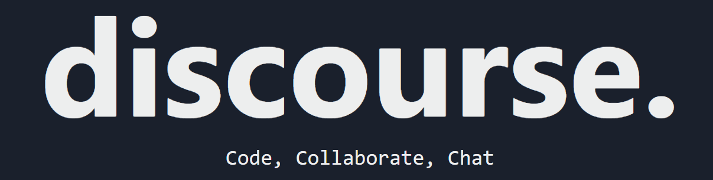
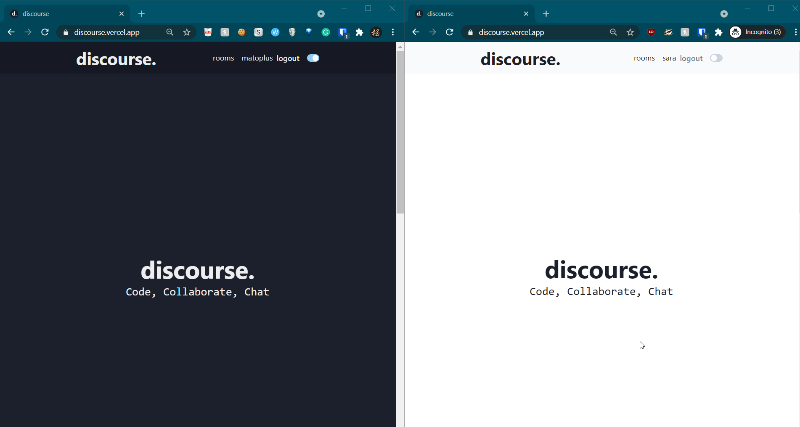

# discourse

<p align="center">
    
</p>


## About
Code, collaborate, and chat together with discouse. The discourse platform
offers real-time, cooperative code rooms. Choose from over 100 languages. Go beyond generic code sharing
platforms, utilize powerful functionalities along with simple and
intuitive interfaces. Try it out at https://discourse.vercel.app/. Make sure it give it a sec for the backend on heroku to wake up.

## Demo



## Setup
```bash
git clone https://github.com/MatoPlus/discourse
cd discourse
cd server && cd npm i
cd ../client && npm i
```

## Running the app for development
Both client, server, and socket url will need to be started up separately

client
```bash
cd client && npm run dev
```

socket
```bash
cd client && npx y-websocket-server
```

server
```bash
cd server && npm run watch # actively compiles to javascript, hangs
cd server && npm run dev # runs the compiled javascript
```

## Environmental variables
Corresponding .env files are required in both the client and server directory.

`client/.env.local`
```
NEXT_PUBLIC_API_URL=<url of API hosted by server>
NEXT_PUBLIC_SOCKET_URL=<url of websocket for p2p CRDT handling>
```

`server/.env`
```
DATABASE_URI=<MongoDB connection url>
PORT=<port for server to listen on>
ACCESS_JWT_SECRET=<JWT secret, generated securely>
REFRESH_JWT_SECRET=<JWT secret, generated securely>
RECOVER_JWT_SECRET=<JWT secret, generated securely>
CORS_ORIGIN=<url of client, allow API calls from client>
```

## Main Technologies
- [MongoDB Atlas](https://www.mongodb.com/cloud/atlas) - Persist rooms and users in the platform
- [Yjs](https://docs.yjs.dev/) - Integrates CRDT (Conflict-free replicated data type) to prevent conflict issues
- [Express.js](https://expressjs.com/) - Used to setup backend logic via REST API
- [Socket.io](https://socket.io/) - Used sockets to implement real-time interactions between users
- [Next.js](https://nextjs.org/) - Used to do deliver better server/client-side rendering, faster pages!
- [Node.js](https://nodejs.org/en/) - Used as a Javascript runtime to build the platform 
- [Typescript](https://www.typescriptlang.org/) - Superset of Javascipt, using static typing to enrich development
- [React](https://reactjs.org/) - Used to build frontend/user interface of the platofrm
- [Chakra UI](https://chakra-ui.com/) - Used to create accessible UI components